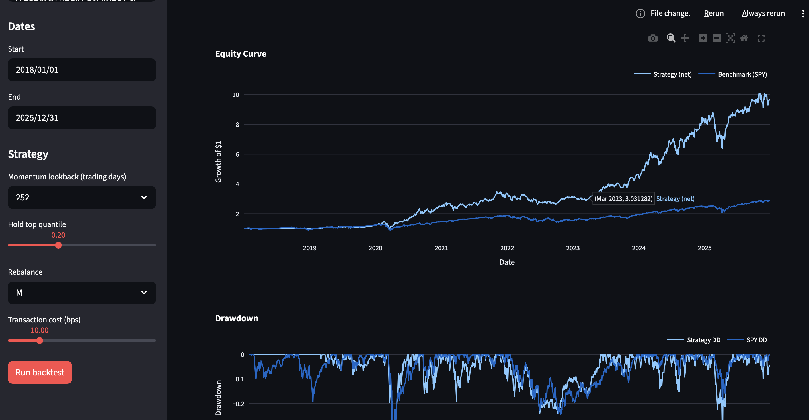

# Stock-Analysis



An interactive **factor research and portfolio backtesting dashboard**
built with **Python, Streamlit, and Plotly**.

The application allows users to analyze stock momentum factors,
construct a rule-based portfolio strategy, and evaluate performance
against a benchmark.

This project demonstrates skills in **data analysis, financial time
series processing, feature engineering, and interactive dashboard
development**.

------------------------------------------------------------------------

# Demo

The dashboard allows users to:

-   Select a universe of stocks\
-   Choose factor parameters\
-   Run a historical backtest\
-   Visualize performance and risk metrics

Key visualizations include:

-   Equity curve vs benchmark
-   Drawdown comparison
-   Portfolio holdings
-   Strategy metrics (Sharpe, CAGR, volatility)

------------------------------------------------------------------------

# Features

## Data Pipeline

-   Downloads historical daily stock data using **Yahoo Finance**
-   Local caching to speed up repeated runs
-   Automatic alignment and cleaning of price data

## Feature Engineering

Currently implemented factors:

-   **Momentum** (63 / 126 / 252 day lookback)

Future extensions: - RSI - Volatility - SMA distance - Factor
correlation heatmap

## Strategy Engine

Example strategy included:

**Momentum Long-Only Portfolio** - Select top quantile of stocks ranked
by momentum - Equal-weight selected stocks - Monthly or weekly portfolio
rebalancing

## Backtesting Engine

Includes realistic mechanics:

-   Transaction cost model (basis points per trade)
-   Portfolio turnover calculation
-   Rebalancing schedule
-   Portfolio return aggregation

## Performance Metrics

The dashboard calculates:

-   CAGR
-   Annualized volatility
-   Sharpe ratio
-   Maximum drawdown
-   Portfolio turnover

## Interactive Dashboard

Built with **Streamlit + Plotly**.

Users can adjust:

-   Momentum lookback window
-   Portfolio quantile threshold
-   Rebalancing frequency
-   Transaction costs
-   Stock universe

Charts update dynamically after running a backtest.


# Installation

## First Run in Project Folder

Create a virtual environment:

``` bash
python3 -m venv .venv
source .venv/bin/activate
```

Install dependencies:

``` bash
pip install -r requirements.txt
```

------------------------------------------------------------------------

# Running the Dashboard

Launch the Streamlit app:

``` bash
python -m streamlit run app/Home.py
```

Then open the provided local URL (usually `http://localhost:8501`).

------------------------------------------------------------------------

# Example Strategy Logic

1.  Compute momentum for each stock over a lookback period
2.  Rank stocks by momentum score
3.  Select the top quantile
4.  Assign equal weights
5.  Rebalance portfolio periodically
6.  Track daily returns and costs

------------------------------------------------------------------------

# Technologies Used

-   Python
-   Pandas
-   NumPy
-   Streamlit
-   Plotly
-   yfinance
-   SciPy


